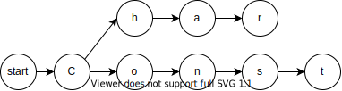
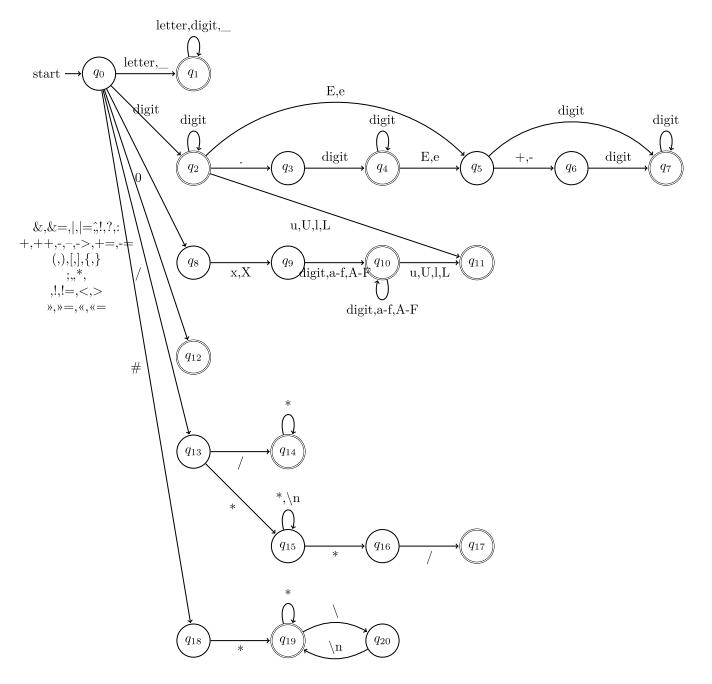
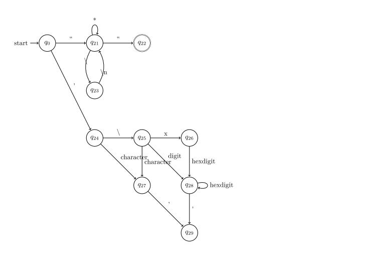
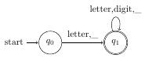
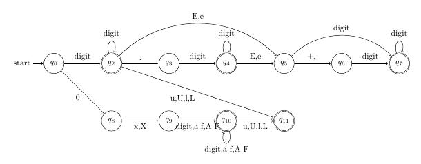
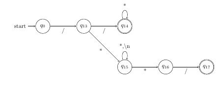
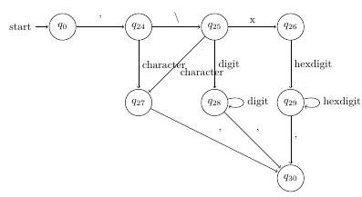
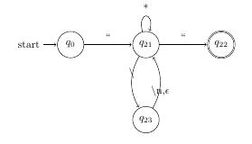

# 一、需求分析

设计并实现 C 语言的词法分析程序，要求如下。
1) 可以识别出用 C 语言编写的源程序中的每个单词符号，并以记号的形式
输出每个单词符号。
2) 可以识别并跳过源程序中的注释。
3) 可以统计源程序汇总的语句行数、单词个数和字符个数，并输出统计结
果。
4) 检查源程序中存在的错误，并可以报告错误所在的位置。
5) 发现源程序中存在的错误后，进行适当的恢复，使词法分析可以继续进
行，对源程序进行一次扫描，即可检查并报告出源程序中存在的词法错误。
## 数据流图
词法分析程序主体为一个DFA（但有一部分状态超前读取或者使用了栈），通过识别 C 语言代码中的各类token，并划分出来生成 token 流以便于后续语法分析。其数据流图大致如下：  


## 功能
* 给出词法分析的token列表
   * 识别和跳过宏和注释（支持跨行）
   * 区分浮点数和整数，支持16进制输入和后缀ul(`unsigned`,`long`)
   * 支持嵌套括号识别和错误判断
   * 支持对单字符(包括`'\x123'`,`'\123'`,`'\n'`,`'a'`等形式)的识别
   * 支持跨行字符串
* 给出分析中出现的错误
* 给出语句行数，单词（标识符）个数和字符个数
* 对于token位置和错误位置
* 友好的位置debug输出（输出的位置信息形如`xxx.c:3:14`,在大部分IDE中可以直接跳转到这一行）

## 开发环境
windows+vscode+MinGW gcc8.0 +CMake 2.20


# 二、总体设计

## 数据结构设计

### Token

```c++
struct Token{
    static string filename; 
    int type; // 类型
    int line; // 行号
    int pos; // 在每行的位置
    string content; // 具体的内容
};
```

从代码中识别到的所有符号信息。

其中类型有宏，标识符，关键字，浮点数，整数，注释，操作符，字符，字符串，小括号，中括号，大括号12种。


### Error

```c++
struct Error{
        int line; // 行号
        int pos; // 在每行的位置
        std::string::const_iterator iter; // 字符串内的位置
        string description; // 描述
        static string filename;
};
```

出现的错误的具体信息


### LexReport

```c++
struct LexReport{    
    vector<Token> tokens; // 符号信息
    vector<Error> errors; // 错误信息
    int lines;  // 行数
    int words; // 单词总数
    int count; // 字符总数
    bool is_error;  // 是否出现错误
    bool is_failed; // 是否是异常终止
};
```

LexReport对象有符号信息，错误信息，行数，单词总数，字符总数，是否错误或异常等数据。


###  Trie树

trie，又称前缀树或字典树，是一种有序树，用于保存关联数组，其中的键通常是字符串。与二叉查找树不同，键不是直接保存在节点中，而是由节点在树中的位置决定。一个节点的所有子孙都有相同的前缀，也就是这个节点对应的字符串，而根节点对应空字符串。一般情况下，不是所有的节点都有对应的值，只有叶子节点和部分内部节点所对应的键才有相关的值。

Trie树可以看做是一个简单的自动机。例如，对于`char`和`const`是这样存储的：



在这个项目中，Trie的基本结构如下：

其中`is_final`标记其是否为一个有效的结束点。

```c++
class TrieNode{
		friend Trie;
		TrieNode* key[KEY_NUM];
		bool is_final;
    // ...
};
class Trie{
	public:
		Trie(const map<string,int>&v);
		int check(const string& str);
	private:
		TrieNode root;
};
```

## 用户接口设计

### parse

```c++
shared_ptr<LexReport> parse(const string &code);
```

这是用于词法分析的函数。输入是一个包含代码的字符串，输出是一个以`LexReport`形式封装的智能指针。LexReport对象有符号信息，错误信息，行数，单词总数，字符总数，是否错误或异常等数据。


### operator <<

```c++
ostream& operator <<(ostream& os,const Token& token)
ostream& operator <<(ostream& os,const Error& error)
```

重载了`<<`符号，用户可以直接以封装好的方式打印出token信息和异常信息。比如：

token的输出格式是这样的：

```
test\test_data\literal.c:3:1 type: 关键字       int
```

error的输出格式是这样的：

```
test\test_data\error.c:11:2 大括号未闭合
```


## 总体结构设计

### 设计原理

整个程序主体的自动机如下：





（符号部分的识别和上图有点差异，例如`+`，`+=`，`++`的判断需要超读一位，这里不再一一画出）

本程序支持识别宏，标识符，关键字，浮点数和整数，注释，各种操作符，字符，字符串，三种括号。下面就这几种逐一说明。

#### 宏 


C语言的宏指令全部都是`#`开头的，这部分不需要特别处理，只需要类似字符串的处理即可。

但是宏也可以跨行，例如:

```c
#define FUNC(x) \
				x+2
```

因此还要判断一下这个宏是否跨行。这里简单地判断`\`，如果出现`\`就等待换行，当然，这里没有再考虑转义`\\`等问题了。


#### 标识符


c语言中标识符是以字母或下划线开头的，由数字，字母和下划线组合的一个字符串。为了加快速度，在一开始处理的时候，把关键字也认为是标识符。

####  关键字

为了方便后面的文法分析，这里把所有关键字都分成了不同的Token。在词法分析结束后，将会对扫描一遍所有的标识符，如果标识符是关键字，那么就将其类型改为相应的关键字。

####  浮点数和整数


上图中，第一行是浮点数，而第二行是整数。

c语言中支持识别的浮点数形式为：`3.14`,`3.14e2`,`3e2`,`3e-2`等等。除此以外，还有一些比较特殊的`.314`(0.314)。上图中没有画出，但是在具体实现中也实现了。

c语言支持10进制，16进制，8进制整数。同时支持显式标注类型（`unsigned`,`long`)。这里因为时间原因，只做了10进制和16进制的形式和后缀的识别。对于8进制的形式，会被识别成10进制的数字。

#### 注释

c语言中有`//`和`/* */`两种注释


在识别的时候，会超前读取一个字符，如果是`/`，则进入q14，否则进入`q15`。对于`//`单行注释，不能换行，`/*`是段注释。

####  操作符

这里支持的操作符如下所示：

| 符号     |         |
| -------- | ------- |
| =        | <,<=    |
| ==       | >,>=    |
| +,+=     | >>=,<<= |
| ++       | ? :     |
| !,!=     | \|,\|=  |
| -        | &&      |
| --       | \|\|    |
| -=       | ,       |
| ->       | ;       |
| `*`,`*=` | .       |
| `/`,`/=` | &,&=    |
| %,%=     | ^,^=    |

####  字符常量


字符串常量由单引号括起来。一般而言，字符串常量如果是多个字符是未定义行为，一些编译器仍然可以处理这样的常量。但这可能主要是为了做历史兼容。在本程序中，普通的字符常量只允许有一个字符，多于一个字符会报错。此外，也允许有转移形式的字符，例如`\n`,`\x40`,`\64`。

上图中，`q0-q24-q27-q30`识别的是普通字符；`q0-q24-q25-q27-q30`识别的是形如`\n`的常量；`q0-q24-q25-q28-q30`识别的是转义字符，最后的路径识别的是16进制转义字符

####  字符串常量



字符串常量和宏的处理类似。这里为了防止转义符被跳过，同样也会超读一位，如果`\`后面不是`\n`，那么就会当成普通字符来处理。

####  括号

嵌套括号主要通过一个PDA来识别。每遇到一个左括号时，压入括号栈，遇到一个右括号时，弹出一个括号，如果两个括号类型一致，那么就记录。否则报错。

### 错误类型

| 错误类型                         | 解释                |
| -------------------------------- | ------------------- |
| 括号未闭合                       | 左右括号不匹配      |
| 浮点数后非数字                   | 形如`2.a`的错误     |
| 浮点数'E'符号后面为非+,-或者数字 | 形如`3.14eat`的错误 |
| 浮点数E符号后非数字              | 形如`3.14e2a`的错误 |
| 非法16进制数                     | 形如`0xhello`的错误 |
| 注释格式错误                     | 注释未闭合          |
| 字符串未闭合                     |                     |
| 字符格式错误                     |                     |

# 三、详细设计

## Parse函数

parse 函数的主体是一个switch case语句。在遍历所有代码字符的过程中，主要维护了以下几个变量：

| 类型            | 变量名             | 备注                                                         |
| --------------- | ------------------ | ------------------------------------------------------------ |
| int             | state              | 表示状态机的状态                                             |
| bool            | jump_line          | 对于字符串和宏，是否允许跨行                                 |
| char            | panic_stop_char    | 出现异常时，向下读取直到读到什么字符时停止。（0表示任意空白符） |
| int             | line,pos,cusum_pos | 行号，每行的偏移量，累计偏移量（自第一个字符）               |
| stack           | parentheses_stack  | 括号栈，用于括号的PDA                                        |
| `vector<Token>` | result             | token列表                                                    |
| `vector<error>` | error              | error列表                                                    |

对于每一个state，都有相应的case和对应的转移语句。内部实现的状态和上面展示的状态略有不同，只有25个，因为程序里不完全是一个DFA（而是一个图灵机），为了编程方便和简洁起见，我压缩了部分状态。

以标识符的case语句为例：

```cpp
case ID: // 标识符
if (!(isalpha(ch) || isdigit(ch) || ch == '_'))
{
    state = IDLE;
    set_str(result, last_IDLE_pointer, iter);
    goto CHECK_AGAIN; // 重新检查当前字符
}
break;
```

这个对应的是q1状态。当标识符识别到第一个不是字母，数字或下划线的字符时，就会跳出当前q1状态，认定为结束。当然，还要重新检查一下当前字符。


对于括号，会把它压入栈进行处理：

```cpp
else if (ch == '(' || ch == '[' || ch == '{')
{
    // 括号
    state = IDLE;
    auto token = ch == '(' ? TOKEN_PARENTHESES : ch == '[' ? TOKEN_BRACKET
        : TOKEN_BRACE;
    // 确定括号的类型
    result.push_back(Token{token, line, pos, ch});
    parentheses_stack.emplace(ch, result.size() - 1, iter); // 压入括号栈
}
else if (ch == ')' || ch == ']' || ch == '}')
{
    state = IDLE;
    auto top = parentheses_stack.top();
    auto last_bracket = std::get<0>(top);// 获取栈顶括号
    if (last_bracket == '(' && ch == ')' ||
        last_bracket == '[' && ch == ']' ||
        last_bracket == '{' && ch == '}')
    {// 如果栈顶括号匹配
        auto token = ch == ')' ? TOKEN_PARENTHESES : ch == ']' ? TOKEN_BRACKET
            : TOKEN_BRACE;
        result.push_back(Token{token, line, pos, ch});// 保存符号
        // auto token = std::get<1>(top);
        // result[token].set_str(std::get<2>(top),iter+1);
        parentheses_stack.pop();
    }
    else
    {
        error.emplace_back(line, pos, iter, "括号未闭合");
    }
}
```

在case中，我大量使用了`goto`。这主要是为了方便进行控制流管理。

`goto`的目标主要有4个：`CHECK_AGAIN`(重新检查当前字符),`JUMP`（不检查当前字符）,`ERROR`(出现错误，向后移动一段距离)，`FAILED`(异常，直接跳出程序)

其中,ERROR标签的主要内容是这样的：

```cpp
ERROR:
result.pop_back();
if (ch == '\n')
{
    cusum_pos += pos;
    pos = 1;
    line += 1;
}
else
    pos++;
char ch2;
if (panic_stop_char == 0)
{
    while (iter != code.end() && !isblank(*iter))
    {
        pos++; //不会遇到\n
        iter++;
    }
}
else
{
    while (iter != code.end() && ((ch2 = *iter) != panic_stop_char))
    {
        if (ch2 == '\n')
        {
            cusum_pos += pos;
            pos = 1;
            line += 1;
        }
        else
            pos++;
        iter++;
    }
}

// 重置信号
state = IDLE;
panic_stop_char = 0;
jump_line = false;
continue;
FAILED:
report->is_failed = true;
return report;
```

这部分实现的功能是：如果指定了`panic_stop_char`,那么移动游标直到当前字符等于`panic_stop_char`；如果没有指定，移到下一个空白符处。

例如，识别`2.3ea + 2`时会发生错误。这时候会向后移动指针到a的后面（是一个空格），然后继续恢复处理。当然，跳到空格处处理的话，对于`2.3ea+2+ 3`的情况就会直接跳到3那边，也就是说，连在一起的东西都没法识别了。但是对于分析一个错误，这样的牺牲是值得的。


## Trie

```cpp
class Trie{
	public:
		Trie(const map<string,int>&v);
		int check(const string& str);
	private:
		TrieNode root;
};
```

### 初始化

Trie树构建时，需传入一个代表字符串和标识符码的字典。比如：

```cpp
Trie(map<string,int>{{"char",1},{"main",2},{"const":3}})
```

其构建过程如下：

```cpp
for(auto &p:v){
    TrieNode* now = &root;
    auto &str = p.first;
    if(p.second<0)continue;
    for(auto cc:str){
        if(!isalpha(cc))throw;
        char c = tolower(cc);
        if (now->key[c-'a']==nullptr){
            now->key[c-'a'] = new TrieNode();
        }
        now = now->key[c-'a'];

    }
    now->type = p.second;
    now->set_final();
}
```

大致过程就是把逐一遍历字符，如果当前层次尚未建立该字符的节点，那么建立一个节点。建立完成后，打上标记，说明到此处结尾的字符串有效。

### 检查

使用时，调用check函数并传入一个字符串。如果这个字符串在`Trie`中，那么返回它相应的标记（数字），否则，返回-1.

```cpp
int Trie::check(const string& str){
	TrieNode* now = &root;

	for (auto &cc:str){
		if(!isalpha(cc))return -1;
		char c = tolower(cc);
		if(now->key[c-'a']!=nullptr){
			now = now->key[c-'a'];
		}else{
			return -1;
		}
	}
	if(now->is_final)return now->type;
	else return -1;
}
```

# 四、程序测试

## 测试宏

#### 源程序

```c
#include<stdio.h>
#include<math.h>
#include<stdio.h>
#define PI 3.14
#define INC(x) x+1
#define FUNC(x) \
				x+2
int main(){}

```

#### 输出

```
F:\program\clex\test\test_data\macro.c:1:1 type: 宏     #include<stdio.h>
F:\program\clex\test\test_data\macro.c:2:1 type: 宏     #include<math.h>
F:\program\clex\test\test_data\macro.c:3:1 type: 宏     #include<stdio.h>
F:\program\clex\test\test_data\macro.c:4:1 type: 宏     #define PI 3.14
F:\program\clex\test\test_data\macro.c:5:1 type: 宏     #define INC(x) x+1
F:\program\clex\test\test_data\macro.c:6:1 type: 宏     #define FUNC(x) \
                                x+2
F:\program\clex\test\test_data\macro.c:8:1 type: 关键字 int
F:\program\clex\test\test_data\macro.c:8:5 type: 标识符 main
F:\program\clex\test\test_data\macro.c:8:9 type: 小括号 (
F:\program\clex\test\test_data\macro.c:8:10 type: 小括号        )
F:\program\clex\test\test_data\macro.c:8:11 type: 大括号        {
F:\program\clex\test\test_data\macro.c:9:1 type: 大括号 }
```

## 测试常量

这一部分主要是测试各种常量的输入能否正常识别，如:

* 带e的浮点数
* e后带符号的浮点数
* 16进制
* 带后缀的整数
* 带后缀的16进制
* 4种字符形式
* `.2`形式的浮点数
* 跨行字符串
* 块注释

```c
#define FUNC(x) \
				x+2
int main(){
	double a = -1.23; // This is comment;
	double b = -3.14e-2;
	double c = 2;
	double d = 3.14e2;
	double e = +2;
	int f = 0x7fffff;
	int g = 2ul;
	int h = 0x77ffful;
	int i = 0xfeel;
	char j = 'a';
	char k = '\n';
	char l = '\123';
	char m = '\x40';
	char l = .002;
	const char *str = "Hello,world\n"
					  "jump to next line";
	const char *str1 = "yet another\n\
					  	hello world";
}
/**
 * @brief 
 * 
 */
```

### 输出

```
F:\program\clex\test\test_data\literal.c:1:1 type: 宏   #define FUNC(x) \
                                x+2
F:\program\clex\test\test_data\literal.c:3:1 type: 关键字       int
F:\program\clex\test\test_data\literal.c:3:5 type: 标识符       main
F:\program\clex\test\test_data\literal.c:3:9 type: 小括号       (
F:\program\clex\test\test_data\literal.c:3:10 type: 小括号      )
F:\program\clex\test\test_data\literal.c:3:11 type: 大括号      {
F:\program\clex\test\test_data\literal.c:4:2 type: 关键字       double
F:\program\clex\test\test_data\literal.c:4:9 type: 标识符       a
F:\program\clex\test\test_data\literal.c:4:11 type: 操作符      =
F:\program\clex\test\test_data\literal.c:4:13 type: 操作符      -
F:\program\clex\test\test_data\literal.c:4:14 type: 浮点数      1.23
F:\program\clex\test\test_data\literal.c:4:18 type: 操作符
F:\program\clex\test\test_data\literal.c:4:20 type: 注释        // This is comment;
F:\program\clex\test\test_data\literal.c:5:2 type: 关键字       double
F:\program\clex\test\test_data\literal.c:5:9 type: 标识符       b
F:\program\clex\test\test_data\literal.c:5:11 type: 操作符      =
F:\program\clex\test\test_data\literal.c:5:13 type: 操作符      -
F:\program\clex\test\test_data\literal.c:5:14 type: 浮点数      3.14e-2
F:\program\clex\test\test_data\literal.c:5:21 type: 操作符
F:\program\clex\test\test_data\literal.c:6:2 type: 关键字       double
F:\program\clex\test\test_data\literal.c:6:9 type: 标识符       c
F:\program\clex\test\test_data\literal.c:6:11 type: 操作符      =
F:\program\clex\test\test_data\literal.c:6:13 type: 整数        2
F:\program\clex\test\test_data\literal.c:6:14 type: 操作符
F:\program\clex\test\test_data\literal.c:7:2 type: 关键字       double
F:\program\clex\test\test_data\literal.c:7:9 type: 标识符       d
F:\program\clex\test\test_data\literal.c:7:11 type: 操作符      =
F:\program\clex\test\test_data\literal.c:7:13 type: 浮点数      3.14e2
F:\program\clex\test\test_data\literal.c:7:19 type: 操作符
F:\program\clex\test\test_data\literal.c:8:2 type: 关键字       double
F:\program\clex\test\test_data\literal.c:8:9 type: 标识符       e
F:\program\clex\test\test_data\literal.c:8:11 type: 操作符      =
F:\program\clex\test\test_data\literal.c:8:13 type: 操作符      +
F:\program\clex\test\test_data\literal.c:8:14 type: 整数        2
F:\program\clex\test\test_data\literal.c:8:15 type: 操作符
F:\program\clex\test\test_data\literal.c:9:2 type: 关键字       int
F:\program\clex\test\test_data\literal.c:9:6 type: 标识符       f
F:\program\clex\test\test_data\literal.c:9:8 type: 操作符       =
F:\program\clex\test\test_data\literal.c:9:10 type: 整数        0x7fffff
F:\program\clex\test\test_data\literal.c:9:18 type: 操作符
F:\program\clex\test\test_data\literal.c:10:2 type: 关键字      int
F:\program\clex\test\test_data\literal.c:10:6 type: 标识符      g
F:\program\clex\test\test_data\literal.c:10:8 type: 操作符      =
F:\program\clex\test\test_data\literal.c:10:10 type: 整数       2ul
F:\program\clex\test\test_data\literal.c:10:13 type: 操作符
F:\program\clex\test\test_data\literal.c:11:2 type: 关键字      int
F:\program\clex\test\test_data\literal.c:11:6 type: 标识符      h
F:\program\clex\test\test_data\literal.c:11:8 type: 操作符      =
F:\program\clex\test\test_data\literal.c:11:10 type: 整数       0x77ffful
F:\program\clex\test\test_data\literal.c:11:19 type: 操作符
F:\program\clex\test\test_data\literal.c:12:2 type: 关键字      int
F:\program\clex\test\test_data\literal.c:12:6 type: 标识符      i
F:\program\clex\test\test_data\literal.c:12:8 type: 操作符      =
F:\program\clex\test\test_data\literal.c:12:10 type: 整数       0xfeel
F:\program\clex\test\test_data\literal.c:12:16 type: 操作符
F:\program\clex\test\test_data\literal.c:13:2 type: 关键字      char
F:\program\clex\test\test_data\literal.c:13:7 type: 标识符      j
F:\program\clex\test\test_data\literal.c:13:9 type: 操作符      =
F:\program\clex\test\test_data\literal.c:13:11 type: 字符       'a'
F:\program\clex\test\test_data\literal.c:13:14 type: 操作符
F:\program\clex\test\test_data\literal.c:14:2 type: 关键字      char
F:\program\clex\test\test_data\literal.c:14:7 type: 标识符      k
F:\program\clex\test\test_data\literal.c:14:9 type: 操作符      =
F:\program\clex\test\test_data\literal.c:14:11 type: 字符       '\n'
F:\program\clex\test\test_data\literal.c:14:15 type: 操作符
F:\program\clex\test\test_data\literal.c:15:2 type: 关键字      char
F:\program\clex\test\test_data\literal.c:15:7 type: 标识符      l
F:\program\clex\test\test_data\literal.c:15:9 type: 操作符      =
F:\program\clex\test\test_data\literal.c:15:11 type: 字符       '\123'
F:\program\clex\test\test_data\literal.c:15:17 type: 操作符
F:\program\clex\test\test_data\literal.c:16:2 type: 关键字      char
F:\program\clex\test\test_data\literal.c:16:7 type: 标识符      m
F:\program\clex\test\test_data\literal.c:16:9 type: 操作符      =
F:\program\clex\test\test_data\literal.c:16:11 type: 字符       '\x40'
F:\program\clex\test\test_data\literal.c:16:17 type: 操作符
F:\program\clex\test\test_data\literal.c:17:2 type: 关键字      char
F:\program\clex\test\test_data\literal.c:17:7 type: 标识符      l
F:\program\clex\test\test_data\literal.c:17:9 type: 操作符      =
F:\program\clex\test\test_data\literal.c:17:11 type: 浮点数     .002
F:\program\clex\test\test_data\literal.c:17:15 type: 操作符
F:\program\clex\test\test_data\literal.c:18:2 type: 关键字      const
F:\program\clex\test\test_data\literal.c:18:8 type: 关键字      char
F:\program\clex\test\test_data\literal.c:18:13 type: 操作符     *
F:\program\clex\test\test_data\literal.c:18:14 type: 标识符     str
F:\program\clex\test\test_data\literal.c:18:18 type: 操作符     =
F:\program\clex\test\test_data\literal.c:18:20 type: 字符串     "Hello,world\n"
F:\program\clex\test\test_data\literal.c:19:8 type: 字符串      "jump to next line"
F:\program\clex\test\test_data\literal.c:19:27 type: 操作符
F:\program\clex\test\test_data\literal.c:20:2 type: 关键字      const
F:\program\clex\test\test_data\literal.c:20:8 type: 关键字      char
F:\program\clex\test\test_data\literal.c:20:13 type: 操作符     *
F:\program\clex\test\test_data\literal.c:20:14 type: 标识符     str1
F:\program\clex\test\test_data\literal.c:20:19 type: 操作符     =
F:\program\clex\test\test_data\literal.c:20:21 type: 字符串     "yet another\n
                                                hello world"
F:\program\clex\test\test_data\literal.c:21:21 type: 操作符
F:\program\clex\test\test_data\literal.c:22:1 type: 大括号      }
F:\program\clex\test\test_data\literal.c:23:1 type: 注释        /**
 * @brief
 *
 */
```


## 测试错误的输出

一共有五个错误：

* 16进制数
* 浮点数后非数字
* 字符串未闭合
* 大括号未闭合
* 块注释

```c
int main(){
	int i = 0xha;
	char c= '1';
	int x = 3.. //first error
	const char *str ="asdasdasd
	
/**
 * 
 * 
 *
	
```

```
tokens
F:\program\clex\test\test_data\error.c:1:1 type: 关键字 int
F:\program\clex\test\test_data\error.c:1:5 type: 标识符 main
F:\program\clex\test\test_data\error.c:1:9 type: 小括号 (
F:\program\clex\test\test_data\error.c:1:10 type: 小括号        )
F:\program\clex\test\test_data\error.c:1:11 type: 大括号        {
F:\program\clex\test\test_data\error.c:2:2 type: 关键字 int
F:\program\clex\test\test_data\error.c:2:6 type: 标识符 i
F:\program\clex\test\test_data\error.c:2:8 type: 操作符 =
F:\program\clex\test\test_data\error.c:2:18 type: 关键字        char
F:\program\clex\test\test_data\error.c:2:23 type: 标识符        c
F:\program\clex\test\test_data\error.c:2:24 type: 操作符        =
F:\program\clex\test\test_data\error.c:2:26 type: 字符  '1'
F:\program\clex\test\test_data\error.c:2:29 type: 操作符
F:\program\clex\test\test_data\error.c:3:2 type: 关键字 int
F:\program\clex\test\test_data\error.c:3:6 type: 标识符 x
F:\program\clex\test\test_data\error.c:3:8 type: 操作符 =
F:\program\clex\test\test_data\error.c:3:15 type: 注释  //first error
F:\program\clex\test\test_data\error.c:4:2 type: 关键字 const
F:\program\clex\test\test_data\error.c:4:8 type: 关键字 char
F:\program\clex\test\test_data\error.c:4:13 type: 操作符        *
F:\program\clex\test\test_data\error.c:4:14 type: 标识符        str
F:\program\clex\test\test_data\error.c:4:18 type: 操作符        =
errors
F:\program\clex\test\test_data\error.c:2:12 非法16进制数
F:\program\clex\test\test_data\error.c:3:12 浮点数后非数字
F:\program\clex\test\test_data\error.c:4:29 字符串未闭合
F:\program\clex\test\test_data\error.c:11:2 其他错误
F:\program\clex\test\test_data\error.c:11:2 大括号未闭合
```

## Sqlite3

https://www.sqlite.org/download.html

词法分析器括号检测部分可能有点问题，会出现一个括号未闭合错误。可能是ifdef的问题，也可能是处理的有问题。

```
errors
F:\program\clex\test\test_data\sqlite3.c:214115:1 括号未闭合
F:\program\clex\test\test_data\sqlite3.c:235518:1 其他错误
```

如果关掉括号检测，仍然会遇到“其他错误”。这个错误是块注释未闭合导致的。

# 代码


